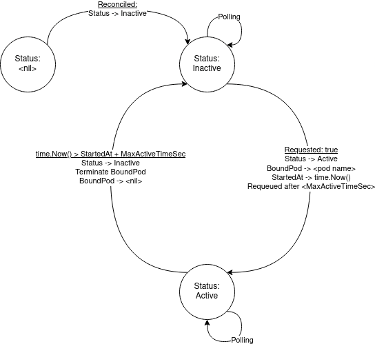

# Kubernetes ScalablePod CRD

This repo centers around the `ScalablePod` CustomResourceDefinition, a (simplistic) wrapper around `Pod`s that does two things:
1. It can scale to zero.
2. It contains a TTL such that the `ScalablePod` can be automatically reset to an inactive state.

This repo uses [kubebuilder](https://book.kubebuilder.io/) to  generate code for the CustomResourceDefinition and scaffold an operator for it.

## Deployment Overview

When in Kubernetes, two `Deployments` live in the the `k8s-operator-example` namespace: the `controller-manager` operator and an externally-exposed `user-facing-server` that listens on a given port. If hit, it POSTs a request to the operator, which starts a `Pod` and (for now) round-robin-schedules one `ScalablePod` to bind to it. After the TTL has expired, the operator automatically terminates the bound `Pod` and resets the `ScalablePod`'s status to `Inactive`. Here's a simplified state machine laying out operation:



## Building and Installing

### Prerequisites
This repository has been built on Ubuntu 20.04 amd64 with the following versions:
- Go v1.16.5
- Docker Engine v20.10.8
- Kind version 0.11.1
- Kubectl client version 1.22.1
- controller-tools (controller-gen) version [6.2.0](https://github.com/kubernetes-sigs/controller-tools/pull/557)

> Note: The build/test steps below are assumed to be on a `kind` cluster

## Steps to Build and Deploy

### Operator
First, create a `kind` cluster:

```kind create cluster```

Next, to deploy the operator and user-facing server, switch contexts:

```kubectl config set-context --current --namespace=k8s-operator-example```

Build the operator Docker:

```make install docker-build IMG=controller:0.1```

Load that image into `kind`:

```kind load docker-image controller:0.1```

Deploy the operator and CRD, along with supporting components:

```make deploy IMG=controller:0.1```

Finally, make the operator deployment available inside the cluster:

```kubectl apply -f controller-manager-service.yaml```


### User-facing Server

Build and load the `user-facing-docker:0.1` image:

```
cd user-facing-server/
make
kind load docker-image user-facing-server:0.1
```

Finally, apply the deployment and external-facing service:

```kubectl apply -f user-facing-server.yaml```

```kubectl apply -f service.yaml```

## Testing

A script located in `config/samples` helps with deploying multiple `ScalablePod` CRs easily:

```
cd config/samples
./add_scalablepod.sh scalablepod1 5 | kc apply -f -
./add_scalablepod.sh scalablepod2 10 | kc apply -f -
./add_scalablepod.sh scalablepod3 10 | kc apply -f -
./add_scalablepod.sh scalablepod4 20 | kc apply -f -
./add_scalablepod.sh scalablepod5 30 | kc apply -f -
```

> Note: While the `ScalablePod` CRs, Operator, and user-facing server are deployed in the `k8s-operator-example` namespace, any `Pod`s are started in the `default` namespace.

To query the user-facing server (when in the kind cluster), do the following:

To find the Node's IP address:

```kc get nodes -owide -o=custom-columns=NAME:.metadata.name,INTERNAL-IP:.status.addresses[0].address```

To find the Node Port to hit:

```kubectl get service -o=custom-columns=NAME:.metadata.name,NODE_PORT:.spec.ports[*].nodePort --field-selector metadata.name=user-facing-service```


Then, to make a request to the system, simply run `curl HOST:PORT`.

### Running Tally of Helpful Resources

[kubebuilder](https://book.kubebuilder.io/)

[To write the operator](https://github.com/kubernetes/client-go/blob/master/examples/in-cluster-client-configuration/main.go)

[To write the CRD](https://kubernetes.io/docs/tasks/extend-kubernetes/custom-resources/custom-resource-definitions/)

[To write the Dockerfile](http://www.matthiassommer.it/programming/compile-and-run-golang-executable-with-docker/)

[For problems with loading images into Kind](https://iximiuz.com/en/posts/kubernetes-kind-load-docker-image/)

[Exposing applications internally](https://kubernetes.io/docs/tutorials/stateless-application/expose-external-ip-address/)

[For adding fields to kubectl get](https://github.com/kubernetes-sigs/kubebuilder/blob/master/docs/book/src/reference/generating-crd.md)
